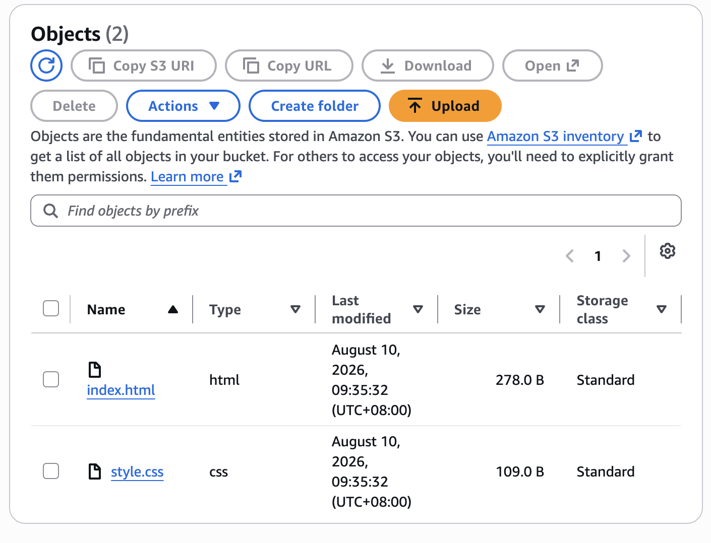
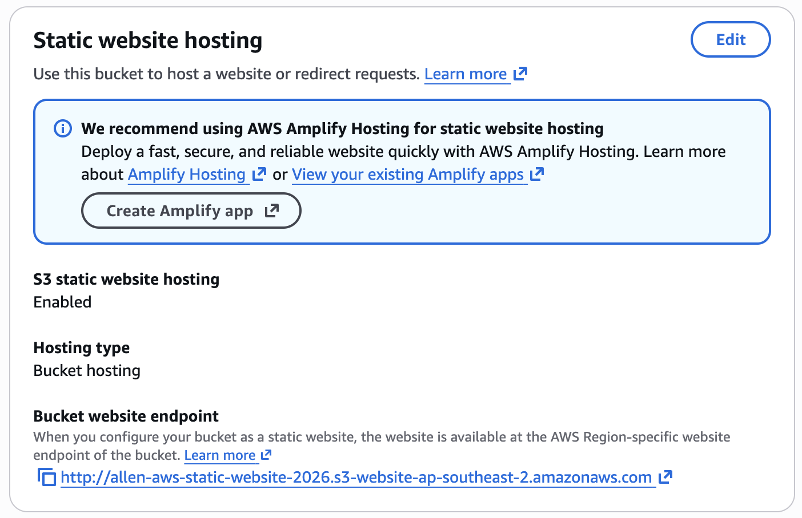
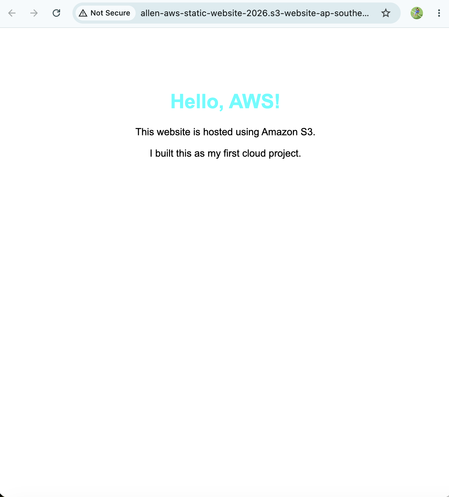

# AWS S3 Static Website

## Overview

This project demonstrates how I deployed a static website using Amazon S3.

The goal of this project was to gain hands-on experience with Amazon S3, static website hosting, object storage, and S3 bucket policies.

The website consists of a simple HTML page and CSS stylesheet and is hosted directly from an S3 bucket using S3 Static Website Hosting.

## Architecture


### Architecture Flow

```text
User / Browser
      |
      | HTTP Request
      v
Amazon S3
Static Website Hosting
      |
      +------> index.html
      |
      +------> style.css
```

## AWS Services Used

| AWS Service / Feature | Purpose |
|---|---|
| Amazon S3 | Stores and serves the static website files |
| S3 Bucket Policy | Allows public read access to the website objects |

## Project Structure

```text
aws-s3-static-website/
├── README.md
├── website/
│   ├── index.html
│   └── style.css
└── docs/
    ├── architecture.png
    ├── s3-bucket-objects.png
    ├── s3-static-website-hosting.png
    └── website-working.png
```

## Implementation

### 1. Create S3 Bucket

Created an S3 bucket to store the static website files.

The bucket uses AWS default server-side encryption.

### 2. Upload Website Files

Uploaded the following files to the S3 bucket:

- `index.html` - Main webpage
- `style.css` - Stylesheet used to customize the webpage



### 3. Enable Static Website Hosting

Enabled S3 Static Website Hosting and configured `index.html` as the index document.



### 4. Configure Public Access

Configured the bucket's public access settings so that the website could be accessed through the S3 website endpoint.

### 5. Create Bucket Policy

Created an S3 bucket policy that allows public `s3:GetObject` access to the website objects.

This allows website visitors to retrieve files such as `index.html` and `style.css`.

The policy does not grant visitors permission to upload, modify, or delete objects.

## Testing

After configuring the bucket and permissions, I accessed the S3 website endpoint through a web browser.

The website successfully loaded and displayed the HTML content and CSS styling.



## Troubleshooting

### 403 Forbidden / Access Denied

The website initially required the correct S3 public-access configuration and bucket policy before the objects could be accessed through the S3 website endpoint.

I configured the appropriate public-access settings and added a bucket policy allowing `s3:GetObject`.

After applying the configuration, the website became accessible.

This helped me understand how AWS permissions can affect access to cloud resources.

## Lessons Learned

- Amazon S3 stores data as objects inside buckets.
- S3 can be used to host static websites.
- Static website hosting requires an index document.
- S3 bucket policies can control access to objects.
- S3 Block Public Access settings can prevent public access even when a bucket policy allows it.
- AWS permissions are an important part of troubleshooting cloud deployments.
- A working deployment does not necessarily mean the architecture is production-ready.
- Publicly accessible resources should not contain sensitive information.

## Security Considerations

This project uses public read access because it is a learning project demonstrating S3 Static Website Hosting.

No sensitive information, credentials, API keys, or private files were stored in the bucket.

For a production deployment, I would avoid exposing the S3 bucket directly to the internet and instead use Amazon CloudFront with a private S3 bucket.

## Cost Considerations

This project was designed to remain within the applicable AWS Free Tier limits.

AWS services can still incur charges if usage exceeds applicable free allowances, so AWS billing and usage should be monitored.

## Project Outcome

Successfully deployed a static website using Amazon S3 and verified that it could be accessed through the S3 website endpoint.

This project gave me practical experience with:

- S3 buckets
- S3 objects
- Static website hosting
- Bucket policies
- Public access configuration
- Basic AWS troubleshooting

## Future Improvements

- Add Amazon CloudFront
- Keep the S3 bucket private
- Enable HTTPS through CloudFront
- Add a custom domain
- Configure Amazon Route 53
- Automate deployment using GitHub Actions
- Manage AWS infrastructure using Terraform
- Add CI/CD
