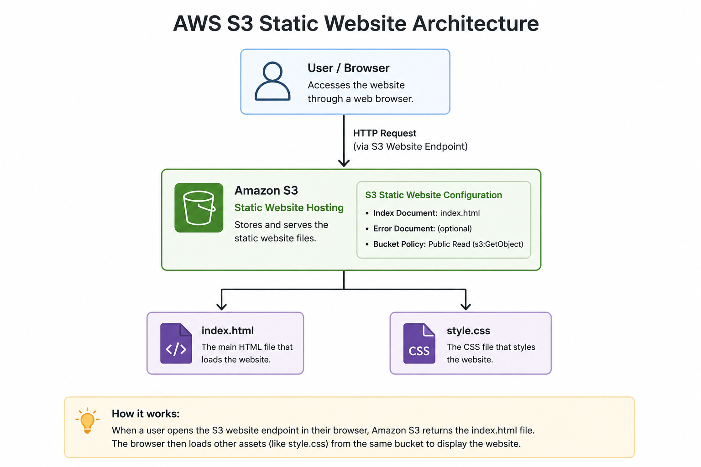

# AWS S3 Static Website

## Overview

This project demonstrates how I deployed a static website using Amazon S3.

The goal of this project was to gain hands-on experience with AWS S3, static website hosting, and S3 bucket policies.

## Architecture



## AWS Services Used

| Service | Purpose |
|---|---|
| Amazon S3 | Stores and serves the static website files |
| S3 Bucket Policy | Controls public read access |


## Project Structure
```text
aws-s3-static-website/
├── README.md
├── website/
│   ├── index.html
│   └── style.css
└── docs/
    └── architecture.png

## Implementation

### 1. Create S3 Bucket

### 2. Upload Website Files

### 3. Enable Static Website Hosting

### 4. Configure Public Access

### 5. Create Bucket Policy

## Lessons Learned

- S3 stores data as objects inside buckets.
- S3 can be used to host static websites.
- Static website hosting requires an index document.
- S3 bucket policies can control access to objects.
- Public access settings can prevent a bucket policy from granting public access.
- AWS permissions are an important part of troubleshooting cloud deployments.


## Future Improvements

- Add Amazon CloudFront
- Use HTTPS
- Keep the S3 bucket private
- Add a custom domain
- Configure Route 53
- Automate deployment using GitHub Actions
- Manage infrastructure using Terraform


